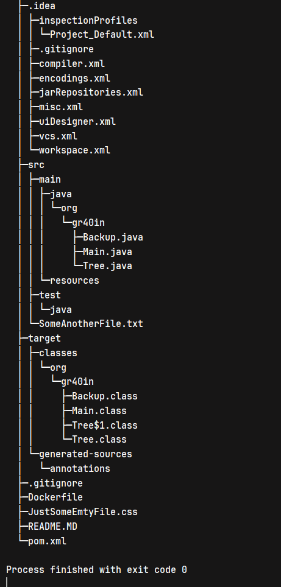

[Backup.java](src%2Fmain%2Fjava%2Forg%2Fgr40in%2FBackup.java)

```java
public class Backup {

    public static void main(String[] args) throws IOException {

        // go up and create backup folder. And into him <backup + Date>
        Path backupFolder = Path.of("..//backup//backup" +
                LocalDateTime.now().format(DateTimeFormatter.ofPattern("-yyyy-MM-dd-hh-mm")));
        makeBackup(Path.of("."), backupFolder);
    }

    public static void makeBackup(Path source, Path destination) throws IOException {

        DirectoryStream<Path> directoryStream =
                Files.newDirectoryStream(source);  //"[!back]*"); glob ignored Backup.java =(

        for (var f : directoryStream) {
            Path newDestination = Path.of(destination.toString() + f.toString());
            if (Files.isDirectory(f)) {
                Files.createDirectories(newDestination);
                makeBackup(f, destination);
            } else //System.out.println(f);
                copyFile(f, destination);
        }
    }

    public static void copyFile(Path file, Path destination) throws IOException {
        FileInputStream inputStream = new FileInputStream(file.toFile());
        FileOutputStream fileOutputStream = new FileOutputStream(Path.of(destination.toString() + file).toFile());
        int count;
        byte[] buffer = new byte[1024];
        while ((count = inputStream.read(buffer)) != -1) {
            fileOutputStream.write(buffer, 0, count);
        }
    }
}
```
[Tree.java](src%2Fmain%2Fjava%2Forg%2Fgr40in%2FTree.java)

```java
package org.gr40in;

import java.io.File;
import java.util.*;
import java.util.stream.Collectors;

/**
 * TODO: Доработать метод print, необходимо распечатывать директории и файлы
 */
public class Tree {

    public static void main(String[] args) {
        print(new File("."), "", true);
    }

    static void print(File file, String indent, boolean isLast) {
        System.out.print(indent);
        if (isLast) {
            System.out.print("└─");
            indent += "  ";
        } else {
            System.out.print("├─");
            indent += "│ ";
        }
        System.out.println(file.getName());

        File[] files = file.listFiles();

        if (files == null)
            return;

        List<File> filesListAll = new ArrayList<>(Arrays.asList(files));

        // sorted for lift folder up, and files down
        filesListAll.sort(new Comparator<File>() {
            @Override
            public int compare(File o1, File o2) {
                if (o1.isDirectory() & (!o2.isDirectory())) return -1;
                else if ((!o1.isDirectory()) & o2.isDirectory()) return 1;
                else return o1.getName().compareTo(o2.getName());
            }
        });

        // im not sure that is correct method for count
        int subDirTotal = (int) filesListAll.stream().filter(File::isDirectory).count();
        int subFilesTotal = (int) filesListAll.stream().filter(File::isFile).count();

        int subDirCounter = 0;
        int subFilesCounter = 0;
        for (int i = 0; i < filesListAll.size(); i++) {
            if (filesListAll.get(i).isDirectory()) {
                print(filesListAll.get(i), indent, subFilesTotal == subFilesCounter
                        & subDirTotal == ++subDirCounter);
            } else print(filesListAll.get(i), indent, subFilesTotal == ++subFilesCounter
                    && subDirTotal == subDirCounter);
        }
    }
}
```

